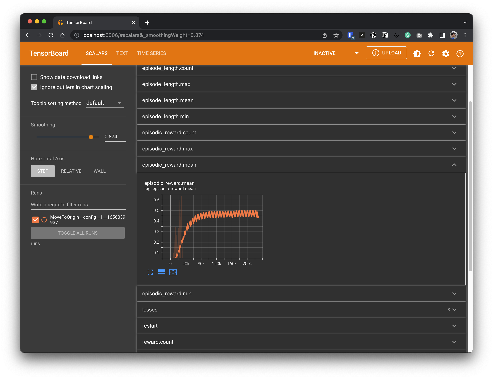

# Entity-oriented PPO Demo

This is a demo of **"entity-oriented" deep reinforcement learning** (name is inspired by "object-oriented programming"). 

Feeling frustrated about not being able to describe your game's observation and action space  using `gym.spaces.Discrete` or `gym.spaces.Discrete` for RL libraries?  Entity-oriented RL comes to the rescue - it gives a much more intuitive observation and action space API to game practioners. Specifically, Entity-oriented RL allows game practioners to describe the entities in the game using JSON-like syntax such as follows:

```
def obs_space(cls) -> ObsSpace:
    return ObsSpace(
        entities={
            "Spaceship": Entity(
                ["x_pos", "y_pos", "x_velocity", "y_velocity", "step"]
            ),
        }
    )

def action_space(cls) -> Dict[str, ActionSpace]:
    return {
        "horizontal_thruster": CategoricalActionSpace(
            [
                "100% right",
                "10% right",
                "hold",
                "10% left",
                "100% left",
            ],
        ),
        "vertical_thruster": CategoricalActionSpace(
            ["100% up", "10% up", "hold", "10% down", "100% down"],
        ),
    }
```

The `main.py` contains an end-to-end example. Please follow the steps below to get started.

## Setup

```bash
poetry install
poetry run pip install torch==1.10.2+cu113 -f https://download.pytorch.org/whl/cu113/torch_stable.html
poetry run pip install torch-scatter -f https://data.pyg.org/whl/torch-1.10.0+cu113.html
```

## Run an experiment

```bash
poetry run python main.py total_timesteps=1000000
```

The schema and documentation of configuration flags (such as `total_timesteps`) can be found [here](https://github.com/entity-neural-network/enn-trainer/blob/main/config-schema.ron)

## Visualize metrics

```bash
tensorboard --logdir runs
```


